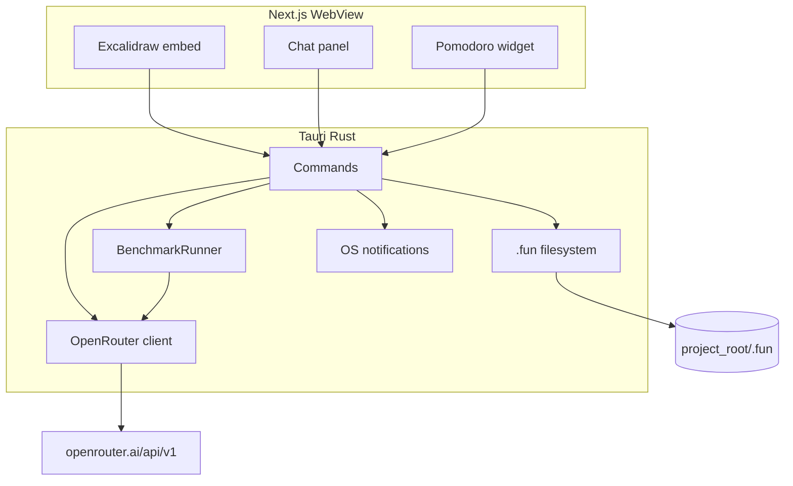
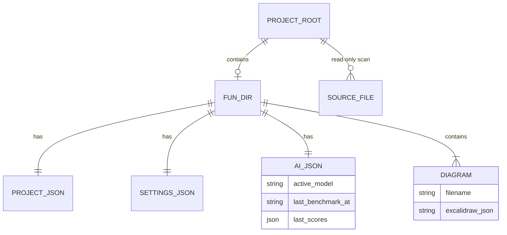

# Architecture Spine — Fun

## Design Paradigm

**Platform boundary** — Tauri (Rust) is the only platform adapter; Next.js (static WebView UI) invokes it exclusively via `@tauri-apps/api` commands and events. Domain logic that touches disk, secrets, OS notifications, or external HTTP lives in Rust; React handles presentation and Excalidraw embed state only.

| Layer | Location | Owns |
| --- | --- | --- |
| UI | `src/` (Next.js, static export) | Layout, Excalidraw embed, chat panel, Pomodoro widget, themes |
| Platform | `src-tauri/` (Rust) | Projet filesystem, `.fun/` persistence, OpenRouter, benchmark, notifications |
| External | OpenRouter API | Inference on `:free` models only |

## Invariants & Rules

### AD-1 — WebView isolation

- **Binds:** all
- **Prevents:** WebView reading arbitrary paths, holding OpenRouter keys, or calling OpenRouter directly
- **Rule:** Next.js code MUST NOT use `fs`, `path`, or direct `fetch` to OpenRouter. All platform I/O goes through typed Tauri commands/events.

### AD-2 — OpenRouter as sole IA provider (MVP)

- **Binds:** FR-3, FR-4, FR-5, FR-6
- **Prevents:** Split-brain providers (Ollama local, OpenCode Zen, multi-gateway) and paid-model drift at MVP
- **Rule:** Rust HTTP client targets `https://openrouter.ai/api/v1` (OpenAI-compatible). Active model ID MUST end with `:free` or be listed in OpenRouter's free catalog at benchmark time. API key stored in Tauri secure store / app config — never in repo or WebView.

### AD-3 — Benchmark-driven model selection

- **Binds:** FR-3, FR-4, FR-5, FR-6
- **Prevents:** Hardcoded model strings scattered in UI and silent stale model choice
- **Rule:** `BenchmarkRunner` (Rust) evaluates a fixed short suite (chat, diagram edit JSON validity, code→UML smoke) against eligible `:free` models. First run at first launch (online); thereafter every **3 days** when online. Result writes `active_model` + `last_benchmark_at` to `.fun/ai.json` (per Projet) or app-level store when no Projet open. Chat and pipelines MUST read active model from this store only. Benchmark MUST stay within OpenRouter free daily quota (~≤5 scenarios × N models per run).

### AD-4 — Projet scope and `.fun/` ownership

- **Binds:** FR-1, FR-2, FR-6
- **Prevents:** Writes outside opened folder, diagram/settings sprawl at repo root
- **Rule:** Opening a folder binds `project_root`. Fun-created artifacts MUST live under `project_root/.fun/` only. Source tree outside `.fun/` is **read-only** for Fun (code→UML scan). On first open, Tauri creates `.fun/` if missing.

### AD-5 — Diagram persistence

- **Binds:** FR-1, FR-2, FR-4, FR-5
- **Prevents:** Ad-hoc formats and saves outside Projet
- **Rule:** Diagrammes are `.excalidraw` JSON files under `.fun/diagrams/`. Save/load exclusively via Tauri commands. Excalidraw embed in Next receives/sends serialized JSON through commands — not direct file paths in WebView.

### AD-6 — Diagram reset (« repartir de zéro »)

- **Binds:** FR-5
- **Prevents:** Ambiguous reset (delete file vs clear canvas vs new file) breaking project list
- **Rule:** Reset overwrites the current diagram file with canonical empty Excalidraw document JSON at the same path; diagram ID and filename unchanged.

### AD-7 — code→UML pipeline (MVP)

- **Binds:** FR-6
- **Prevents:** Per-language parsers blocking multi-lang MVP; invalid JSON landing on canvas
- **Rule:** Implement `CodeExtractor` trait in Rust. MVP ships **`AiExtractor` only**: scan project for source files (multi-extension allowlist), chunk, prompt OpenRouter active model, validate Excalidraw JSON, write `.fun/diagrams/uml-<iso8601>.excalidraw`. Invalid model output MUST NOT be saved; surface error to UI. `TreeSitterExtractor` per language is **Deferred** — must plug in without changing UI contract.

### AD-8 — No application backend (MVP)

- **Binds:** all
- **Prevents:** Premature GCP/Spring Boot scope for a local-first solo MVP
- **Rule:** No Fun-hosted server at MVP. GCP, sync, collab, and deploy backends are **Deferred**. Canvas + Pomodoro work offline; IA and benchmark require network.

### AD-9 — Next.js static export for Tauri

- **Binds:** UI layer
- **Prevents:** SSR/API routes incompatible with Tauri WebView packaging
- **Rule:** Next.js `output: 'export'`; `frontendDist` = `out/`. No Next.js server routes or SSR at MVP.



## Consistency Conventions

| Concern | Convention |
| --- | --- |
| Naming | Tauri commands: `snake_case` verbs (`open_project`, `save_diagram`, `run_benchmark`). Diagram files: `kebab-case.excalidraw`. JSON fields in `.fun/`: `snake_case`. |
| Data & formats | Diagrams: Excalidraw JSON. `.fun/project.json`, `settings.json`, `ai.json` — UTF-8 JSON. Timestamps: ISO 8601 UTC. Errors to UI: `{ code, message }` envelope from commands. |
| State & cross-cutting | Diagram edit state: Excalidraw in WebView; persisted on debounced save command. OpenRouter key: app-level secure store until Projet opened. Pomodoro timer: WebView state; durations persisted in `.fun/settings.json` on change. |

## Stack

| Name | Version |
| --- | --- |
| Tauri | 2.x |
| Next.js | 14.x+ (static export) |
| React | 18.x+ |
| @excalidraw/excalidraw | current npm at init |
| @tauri-apps/api | 2.x |
| Rust reqwest (OpenRouter) | 0.12.x at init |
| OpenRouter API | v1 |

## Structural Seed

```text
fun/                          # repo root
  src/                        # Next.js UI (App Router, static export)
    app/                      # routes: home, project workspace
    components/               # canvas shell, chat, pomodoro, layout
  src-tauri/
    src/
      commands/               # Tauri command handlers
      project/                # .fun/ IO, diagram CRUD
      ai/                     # OpenRouter client, benchmark, CodeExtractor
      notify/                 # Pomodoro OS notifications
    tauri.conf.json
  out/                        # Next static build → frontendDist
```



## Capability → Architecture Map

| Capability / Area | Lives in | Governed by |
| --- | --- | --- |
| FR-1 Ouvrir Projet | `src-tauri/project/` + home UI | AD-1, AD-4 |
| FR-2 Éditer Diagramme | Next Excalidraw + `save_diagram` command | AD-1, AD-5, AD-9 |
| FR-3 Chat | Next panel + `chat_completion` command | AD-1, AD-2, AD-3 |
| FR-4 Modifier diagramme via IA | `ai/` diagram tool + Excalidraw sync | AD-2, AD-5, AD-6 |
| FR-5 Relecture / reset | chat + `reset_diagram` | AD-2, AD-6 |
| FR-6 code→UML | `ai/extractor/ai_extractor.rs` | AD-7, AD-4 |
| FR-7 Pomodoro | Next widget + `notify` + settings persist | AD-1, AD-4, AD-8 |
| FR-8 draw.io (nice) | — | Deferred |
| Benchmark IA | `ai/benchmark.rs` | AD-3 |
| Thèmes / UX layout | Next components | UX DESIGN (seed) |

## Deferred

| Item | Reason |
| --- | --- |
| GCP / Spring Boot backend | No MVP need; local + OpenRouter sufficient |
| draw.io tab (FR-8) | Nice; Plan A placeholder « Bientôt » if blocked |
| TreeSitter / hybrid CodeExtractor per language | IA-first multi-lang covers MVP; parsers added incrementally |
| Collab temps réel, mobile, intégrations Trello/Calendar | PRD out of MVP |
| OpenCode Zen or local Ollama as providers | Superseded by AD-2 (OpenRouter) |
| Full auto-benchmark before first usable model | MVP ships default `:free` model until first benchmark completes |
| App-level vs project-level OpenRouter key split | Default: key app-global; `ai.json` per project for active model only |
