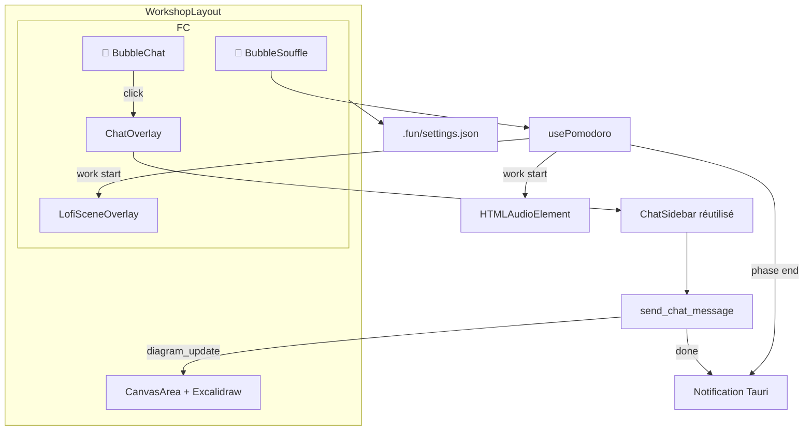
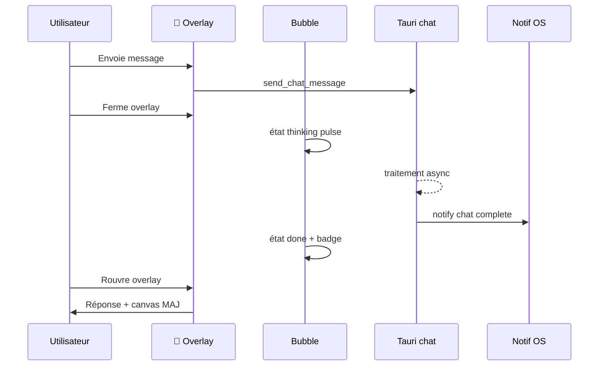

# Architecture — Floating Office

## Composants cibles

## Flux async chat

## Persistance

Positions et préférences compagnons dans `.fun/settings.json` — étendre le schéma Rust `ProjectSettings` et le type TS `ProjectSettings`.
